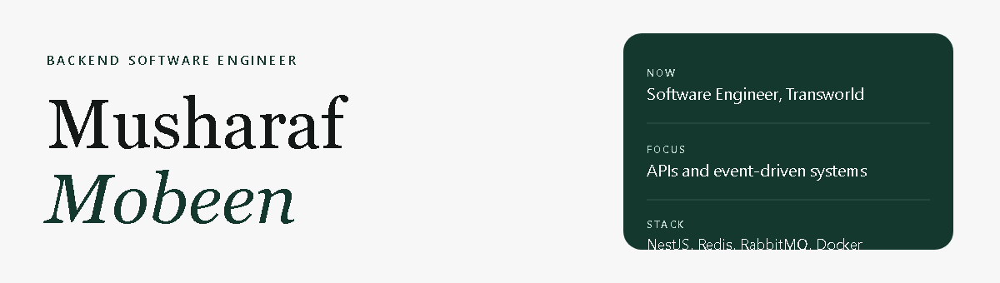

Backend engineer in Islamabad. I build the services behind products people use — telecom operations, a real estate platform, and AI tools.

## Now

Software Engineer at **Transworld**, on the backend behind [My Transworld](https://play.google.com/store/apps/details?id=com.viion.tes&hl=en). NestJS, Redis, RabbitMQ, and Docker.

## Stack

| | |
| --- | --- |
| Languages | TypeScript, JavaScript, Python |
| Backend | NestJS, Express, Fastify, Node.js |
| Data | MySQL, PostgreSQL, MongoDB, Redis, TypeORM |
| Systems | Docker, RabbitMQ, Kafka, AWS, CI/CD |

## Selected work

| Project | What I built | |
| --- | --- | --- |
| [My Transworld](https://play.google.com/store/apps/details?id=com.viion.tes&hl=en) | Customer app and ERP for a Pakistani internet provider: bills, payments, Wi-Fi, and service changes. | [App Store](https://apps.apple.com/pk/app/my-transworld/id1630883425) |
| [Provision AI](https://provision.ai) | AI product backend: Insights, Job Match, CV Revive, realtime notifications, and payments. Express, MySQL, WebSockets. | [Site](https://provision.ai) |
| [UB Realty](https://ubrealty.com) | Listings, floor plans, MLS, appointment scheduling, and maps. | [Site](https://ubrealty.com) |

## Also

Orion, Investor360, Ogra, Cryptotax, Elecktra, and a NestJS resource generator are on the [portfolio](https://musharrafmobeen.github.io/#projects). Some of them do not have a public link yet.

## Experience

| | | |
| --- | --- | --- |
| 2022 — now | Software Engineer | Transworld |
| 2024 | Backend Developer, part-time | SITS |
| 2021 — 2022 | Software Engineer | Techgenix |
| 2020 — 2021 | Freelance Developer | Fiverr |
| 2021 | Intern | Ineffable Devs |
